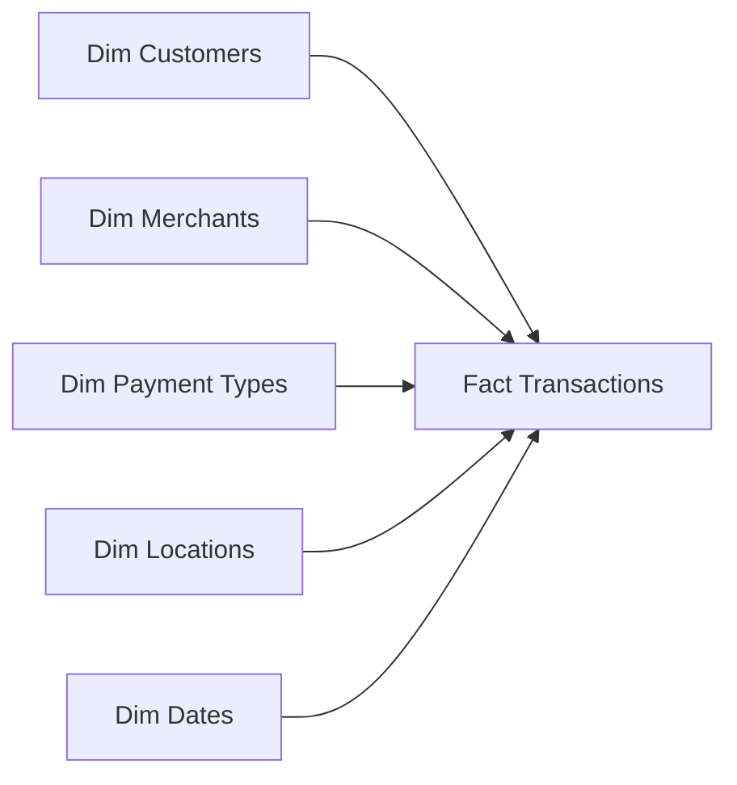

# PayGuard Analytics — Fintech Revenue, Risk & Transaction Intelligence

## Executive Summary
A payment platform operating across South Africa, UAE, UK, and USA required structured visibility into which merchants, markets, and customer segments were driving fee revenue. Furthermore, fraud and failed transactions were silently eroding the bottom line. This analytical project, PayGuard Analytics, processed 500,000 transactions across 10,000 customers and 25 merchants over a 5-year period (2021-2025). The resulting end-to-end data pipeline and executive Power BI dashboard successfully identified R53.69M in fraud exposure and a high 7.94% failed transaction rate threatening platform revenue integrity, enabling targeted interventions.

## 1. Business Problem
The payment platform struggled with:
- **Revenue visibility**: Lack of granular tracking of fee revenue by merchant and market.
- **Transaction performance**: High rates of failed transactions without clear understanding of device or payment method causes.
- **Fraud exposure**: Increasing incidence of fraudulent transactions threatening revenue and trust.
- **Merchant performance**: Inability to quickly rank merchants by revenue contribution and identify concentration risk.
- **Customer segmentation**: Poor understanding of customer lifetime value across different loyalty tiers.

## 2. Project Objectives
- Analyze transaction and fee-revenue performance globally.
- Identify transaction failure patterns across payment methods and devices.
- Measure fraud exposure and fraud rates by market and payment type.
- Compare merchant performance and identify revenue concentration.
- Compare market/geographic performance to locate growth opportunities.
- Analyze customer segments and their respective lifetime values.
- Build an executive Power BI dashboard for ongoing monitoring.
- Generate evidence-based business recommendations.

## 3. Technology Stack
- **SQL Server (T-SQL)**: Data querying, CTEs, Window Functions, Aggregations.
- **Python**: Data generation and initial structuring (Pandas).
- **Power BI**: Interactive executive dashboard, DAX measures, Data Modeling.
- **Git/GitHub**: Version control and portfolio hosting.

## 4. Data Architecture
The data model follows a Star Schema design to optimize analytical queries and Power BI performance.



## 5. Dataset
The dataset comprises 500,000 financial transaction records generated via Python (simulated data).
*Note: The complete `fact_transactions` dataset exceeds GitHub file size limits and is excluded from the repository. It can be generated locally using the provided SQL scripts.*

| Table | Purpose | Key Information |
|-------|---------|-----------------|
| `fact_transactions` | Core transaction events | ~500,000 rows. Includes gross amount, fee, status, fraud flag, device type. |
| `dim_customers` | Customer demographics | 10,000 rows. Customer tier classification. |
| `dim_merchants` | Merchant reference | 25 rows. Categories (e.g., Travel, Retail) and markets. |
| `dim_payment_types` | Payment methods | 8 rows. Digital, Card, Bank Transfer, BNPL. |
| `dim_locations` | Geographic data | 15 rows. Cities, countries, and currencies. |
| `dim_dates` | Time dimension | 1,826 rows. 2021-2025 calendar dates. |

## 6. Data Cleaning & Preparation
- **Missing Values & Integrity**: Ensured full referential integrity across the Star Schema via SQL Foreign Keys.
- **Data Types**: Enforced strict data types for financial columns (DECIMAL) and dates (DATE).
- **Categorization**: Grouped payment methods into broader categories (Digital, Card, Bank Transfer, Credit) within `dim_payment_types`.
- **Status Classification**: Cleaned transaction statuses into standardized buckets (Completed, Failed, Reversed, Pending).

## 7. SQL Analytics
Advanced SQL techniques were applied in `Fintech_Analysis.sql` to uncover insights:
- **CTEs & Window Functions**: Utilized `RANK()` and `LAG()` to analyze month-over-month fee revenue growth and rank merchants by revenue contribution.
- **Aggregations & `GROUP BY`**: Computed gross revenue, fee revenue, and fraud exposure across countries and merchant categories.
- **`CASE` Statements**: Calculated failure rates and fraud rates conditionally.
- **Time-Series Analysis**: Tracked monthly revenue trends over the 5-year period.
- **Revenue Concentration Risk**: Calculated cumulative percentage of total fee revenue driven by top merchants (Pareto analysis).

## 8. Power BI Data Model
- **Star Schema**: 1 Fact Table and 5 Dimension Tables.
- **Relationships**: One-to-many relationships from dimensions to the fact table using primary keys.
- **Filter Context**: Enabled cross-filtering by date, location, merchant, and customer tier.

## 9. KPI Framework
| KPI | Definition | Business Meaning | Decision Supported |
|-----|------------|------------------|--------------------|
| **Gross Revenue** | Total value of all processed transactions (R2.66bn). | Measures total platform scale and volume. | Overall platform growth tracking. |
| **Platform Fee Revenue** | Total fee collected from transactions (R66.40M). | Core revenue metric for the business (~2.5% avg fee). | Revenue target tracking and forecasting. |
| **Fraud Rate** | Percentage of transactions flagged as fraud (2.02%). | Measures risk exposure against the <2% target. | Triggering automated fraud interventions. |
| **Fraud Exposure** | Total gross value of fraudulent transactions (R53.69M). | Financial quantification of platform risk. | Budgeting for fraud prevention tools. |
| **Failed Transaction Rate**| Percentage of failed transactions (7.94%). | Identifies technical/UX friction points against <5% target. | Prioritizing infrastructure and POS testing. |
| **Avg Transaction Value**| Average gross value per transaction (R5.31K). | Measures the typical transaction size. | Customer segmentation and targeting. |

## 10. Power BI Dashboard
The executive dashboard provides an interactive Control Tower with key metrics:
- **Executive Overview**: High-level tracking of Gross Revenue, Platform Fee Revenue, Fraud Rate, and Failed Transaction Rate.
- **Revenue Analytics**: Visualizations of top markets (e.g., USA), top merchants (e.g., Emirates Airlines), and dominant payment types (Digital).
- **Risk & Transaction Analytics**: Deep dive into the 7.94% failure rate by device type (Mobile dominates at 55.29%) and fraud exposure by market.

> **

> **

## 11. Business Questions
- Which countries and merchants generate the most platform fee revenue?
- Where are transaction failures concentrated (device/payment method)?
- How does fraud exposure vary across different markets?
- Which customer tiers drive the highest lifetime value (LTV)?
- Is platform revenue overly concentrated on a small number of merchants?
- What is the month-over-month fee revenue growth trend?

## 12. Key Findings
- **High Failure Rate**: The 7.94% failed transaction rate (translating to ~39,700 lost transactions annually) significantly exceeds the 5% benchmark. Evidence points to POS infrastructure gaps during merchant onboarding, costing an estimated R5.3M in lost fees annually.
- **Fraud Risk**: The fraud rate of 2.02% has resulted in R53.69M in estimated fraud exposure, marginally missing the <2% target and requiring tighter controls.
- **Revenue Concentration**: A significant portion of fee revenue is heavily concentrated in the Travel category (e.g., Emirates Airlines, Airbnb), posing a key merchant dependency risk.
- **Market Dynamics**: The USA leads in total fee revenue due to higher average transaction values, while the UK underperforms despite a strong merchant presence.
- **Digital Dominance**: Mobile devices account for 55.29% of transactions, and Digital wallets are the dominant payment category.

## 13. Recommendations
- **Reduce Transaction Failures**: Implement mandatory POS capability testing during merchant onboarding to reduce the failure rate below 5% (Monitor: *Failed Transaction Rate*).
- **Strengthen Fraud Monitoring**: Deploy automated detection models flagging high-value transactions (e.g., >R50K) from new devices in high-risk categories (Monitor: *Fraud Rate & Exposure*).
- **Protect Merchant Concentration**: Assign dedicated Merchant Success Managers to top fee contributors like Emirates Airlines to mitigate revenue concentration risk (Monitor: *Top Merchant Fee Revenue*).
- **Drive Market Growth**: Launch targeted merchant acquisition and payment method localization in the UK to unlock its underperforming revenue potential.
- **Customer Segmentation**: Introduce a targeted upgrade incentive program for the Standard customer tier (highest volume, lowest LTV) to shift them into Silver/Platinum tiers.

## 14. Limitations
- **Simulated Data**: The dataset was generated programmatically in Python for portfolio demonstration purposes and does not represent real user data.
- **No Real-Time Streaming**: The analysis relies on batch processing; a production environment would require real-time streaming (e.g., Kafka) for instantaneous fraud detection.
- **Lack of External Context**: Economic factors, seasonal shifts outside the 5-year scope, and external fraud labels are not included.

## 15. Future Enhancements
- **Real-Time Payment Monitoring**: Implementing streaming analytics for live transaction health.
- **Automated ETL Pipeline**: Building automated data ingestion from external APIs instead of static CSVs.
- **Machine Learning Fraud Prediction**: Training a classification model (e.g., XGBoost) to predict and decline fraudulent transactions proactively.
- **Cloud Deployment**: Migrating the database to Azure SQL or AWS RDS and automating Power BI refreshes.

## 16. Project Structure
```text
Project 6-Fintech Revenue Analytics/
├── 1. Datasets/
│   ├── README.md
│   ├── Customers.csv
│   ├── Merchants.csv
│   ├── Payment_types.csv
│   ├── Locations.csv
│   └── Dates.csv
├── 2. SQL/
│   └── Fintech_Analysis.sql
├── 3. Dashboard/
│   └── Fintech_Analysis.pbix
├── 4. Images/
│   ├── Dashboard_Preview.png
│   └── Model_View.png
└── README.md
```

## Original Project & Attribution
This project, PayGuard Analytics, was adapted from the original Fintech Revenue Analytics project created by Sanele Siyabonga Thusi.
- **Original Repository**: [Data-Analysis-BI---Portfolio](https://github.com/STCybersec/Data-Analysis-BI---Portfolio)
- **Original Author**: Sanele Siyabonga Thusi

This version contains my own adaptations, documentation structuring, and analysis improvements to showcase advanced portfolio practices.
